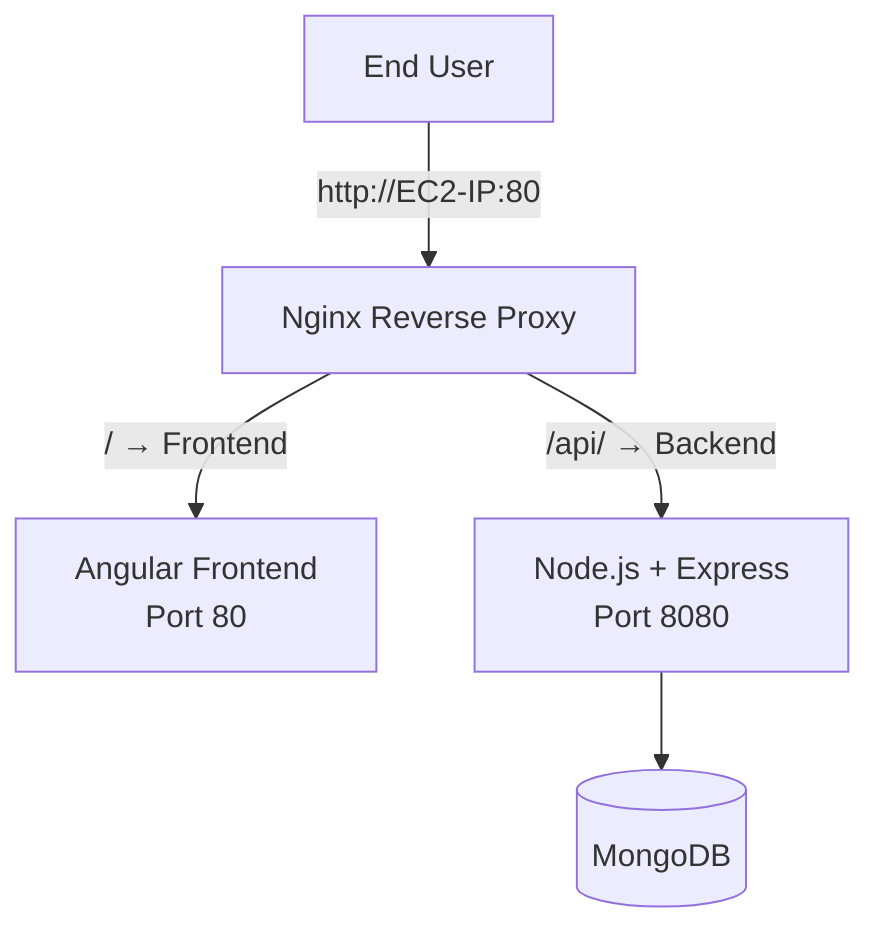

**<h1 align="center">🚀 Discover Dollar – DevOps Internship Assignment</h1>

<h3 align="center">
Full-stack MEAN Application Deployment with Docker, Nginx, CI/CD (GitHub Actions), and AWS EC2.
</h3>
🌐 Discover Dollar – DevOps Assignment
🚀 MEAN App Deployment using Docker, Docker Compose, Nginx, GitHub Actions CI/CD & AWS EC2
🏆 Project Overview

This project completes the DevOps Internship Assignment for Discover Dollar, involving:

Containerizing a MEAN Stack Application

Deploying it on an AWS EC2 Ubuntu Instance

Using Docker, Docker Compose & Nginx Reverse Proxy

Automating deployments with GitHub Actions CI/CD

Storing images on Docker Hub

Ensuring application runs on port 80 via Nginx

💡 The entire pipeline runs automatically on every push to main.

📁 Project Structure
.
├── backend/
├── frontend/
├── docker-compose.yml
├── nginx.conf
└── .github/workflows/build-and-deploy.yml

🐳 Dockerized Architecture
graph TD;
    A[Frontend - Angular] -->|Docker Image| B[Nginx Reverse Proxy];
    C[Backend - Node.js/Express] -->|Docker Image| B;
    D[MongoDB Container] --> C;
    B -->|Port 80| User[End User];

🔧 Tech Stack
Component	Technology
Frontend	Angular + Nginx
Backend	Node.js + Express
Database	MongoDB Docker Container
Reverse Proxy	Nginx
Containerization	Docker & Docker Compose
Cloud	AWS EC2 (Ubuntu 24.04 LTS)
CI/CD	GitHub Actions
Registry	Docker Hub
🚀 Deployment Steps
1️⃣ Clone the repository
git clone https://github.com/<your-username>/<repo>.git
cd repo

2️⃣ Docker Compose Setup on EC2
docker-compose.yml
services:
  mongo:
    image: mongo:6
    restart: unless-stopped
    volumes:
      - mongo-data:/data/db

  backend:
    image: ${DOCKER_USERNAME}/crud-backend:latest
    restart: unless-stopped
    depends_on:
      - mongo
    environment:
      MONGO_URL: "mongodb://mongo:27017/mydb"
    expose:
      - "8080"

  frontend:
    image: ${DOCKER_USERNAME}/crud-frontend:latest
    restart: unless-stopped
    depends_on:
      - backend
    expose:
      - "80"

  nginx:
    image: nginx:alpine
    restart: unless-stopped
    ports:
      - "80:80"
    depends_on:
      - frontend
      - backend
    volumes:
      - ./nginx.conf:/etc/nginx/conf.d/default.conf:ro

volumes:
  mongo-data:

3️⃣ Nginx Reverse Proxy

nginx.conf

server {
    listen 80;

    location /api/ {
        proxy_pass http://backend:8080/;
    }

    location / {
        proxy_pass http://frontend:80/;
    }
}

4️⃣ GitHub Actions CI/CD Workflow

.github/workflows/build-and-deploy.yml

name: build-and-deploy

on:
  push:
    branches: ["main"]

jobs:
  build-and-deploy:
    runs-on: ubuntu-latest

    steps:
    - name: Checkout code
      uses: actions/checkout@v3

    - name: Login to Docker Hub
      uses: docker/login-action@v2
      with:
        username: ${{ secrets.DOCKERHUB_USERNAME }}
        password: ${{ secrets.DOCKERHUB_PASSWORD }}

    - name: Build backend image
      run: |
        docker build -t "${{ secrets.DOCKERHUB_USERNAME }}/crud-backend:latest" ./backend
    - name: Push backend image
      run: docker push "${{ secrets.DOCKERHUB_USERNAME }}/crud-backend:latest"

    - name: Build frontend image
      run: |
        docker build -t "${{ secrets.DOCKERHUB_USERNAME }}/crud-frontend:latest" ./frontend
    - name: Push frontend image
      run: docker push "${{ secrets.DOCKERHUB_USERNAME }}/crud-frontend:latest"

    - name: Copy compose files to EC2
      uses: appleboy/scp-action@v0.1.4
      with:
        host: ${{ secrets.EC2_HOST }}
        username: ubuntu
        key: ${{ secrets.EC2_SSH_KEY }}
        source: "docker-compose.yml,nginx.conf"
        target: "/home/ubuntu/app"

    - name: SSH into EC2 and deploy
      uses: appleboy/ssh-action@v1.0.3
      with:
        host: ${{ secrets.EC2_HOST }}
        username: ubuntu
        key: ${{ secrets.EC2_SSH_KEY }}
        script: |
          echo "${{ secrets.DOCKERHUB_PASSWORD }}" | sudo docker login -u "${{ secrets.DOCKERHUB_USERNAME }}" --password-stdin
          cd /home/ubuntu/app
          echo "DOCKER_USERNAME=${{ secrets.DOCKERHUB_USERNAME }}" > .env
          sudo docker-compose pull
          sudo docker-compose down
          sudo docker-compose up -d

🧪 Testing
✔ Frontend

Open in browser:

http://<EC2-PUBLIC-IP>/

✔ Backend API
curl http://<EC2-PUBLIC-IP>/api/tutorials


(because Nginx forwards /api → backend)

📸 Screenshots to Include in Submission

You MUST include these:

🟩 1. Docker Images built locally

Screenshot of docker images

🟩 2. Docker Hub Repository

Your crud-frontend:latest

crud-backend:latest

🟩 3. Running Containers on EC2

Run:

docker ps


Screenshot required.

🟩 4. Application Working in Browser

Frontend UI

Create / Update tutorial

🟩 5. GitHub Actions Pipeline

Successful run (green check mark)

Steps expanded (build, push, deploy)

🟩 6. Nginx reverse proxy file

Screenshot of nginx.conf

🟩 7. Folder structure on EC2

ls /home/ubuntu/app
**Here’s a clean, professional, and visually appealing **README.md** file that you can directly use for your Discover Dollar DevOps Internship Assignment submission. It includes everything they asked for and looks great on GitHub!

```markdown
<h1 align="center">🚀 Discover Dollar – DevOps Internship Assignment</h1>
<h3 align="center">Full-Stack MEAN Application with Docker, Nginx, CI/CD & AWS EC2</h3>

<p align="center">
  
  
  
  
  
</p>

## 🌟 Project Overview

This project demonstrates a complete end-to-end DevOps implementation of a **MEAN Stack CRUD Application** with the following features:

- Fully Dockerized (Frontend, Backend, MongoDB)
- Nginx as Reverse Proxy
- Automated CI/CD using GitHub Actions
- Zero-downtime deployment on AWS EC2 (Ubuntu 24.04)
- Images stored and pulled from Docker Hub
- Accessible via **port 80** (standard HTTP)

**Every push to `main` triggers automatic build → push → deploy!** 🚀

## 🏗️ Architecture Diagram



## 📁 Project Structure

```
├── backend/                  # Node.js + Express API
├── frontend/                 # Angular 17+ App
├── nginx.conf                # Nginx reverse proxy config
├── docker-compose.yml        # Orchestrates all services
└── .github/workflows/
    └── build-and-deploy.yml  # GitHub Actions CI/CD Pipeline
```

## 🐳 Docker Compose Configuration

```yaml
services:
  mongo:
    image: mongo:6
    restart: unless-stopped
    volumes:
      - mongo-data:/data/db

  backend:
    image: ${DOCKER_USERNAME}/crud-backend:latest
    restart: unless-stopped
    depends_on:
      - mongo
    environment:
      MONGO_URL: "mongodb://mongo:27017/mydb"
    expose:
      - "8080"

  frontend:
    image: ${DOCKER_USERNAME}/crud-frontend:latest
    restart: unless-stopped
    expose:
      - "80"

  nginx:
    image: nginx:alpine
    restart: unless-stopped
    ports:
      - "80:80"
    depends_on:
      - frontend
      - backend
    volumes:
      - ./nginx.conf:/etc/nginx/conf.d/default.conf:ro

volumes:
  mongo-data:
```

## ⚙️ Nginx Reverse Proxy (`nginx.conf`)

```nginx
server {
    listen 80;

    location /api/ {
        proxy_pass http://backend:8080/;
        proxy_set_header Host $host;
        proxy_set_header X-Real-IP $remote_addr;
    }

    location / {
        proxy_pass http://frontend:80/;
        proxy_set_header Host $host;
    }
}
```

## ⚡️ GitHub Actions CI/CD Pipeline

Fully automated workflow on push to `main`:

- Builds & pushes Docker images to Docker Hub
- Securely copies updated files to EC2
- Pulls latest images & restarts containers

```yaml
# .github/workflows/build-and-deploy.yml
name: Build & Deploy

on:
  push:
    branches: ["main"]

jobs:
  build-and-deploy:
    runs-on: ubuntu-latest
    steps:
      - name: Checkout
        uses: actions/checkout@v3

      - name: Login to Docker Hub
        uses: docker/login-action@v2
        with:
          username: ${{ secrets.DOCKERHUB_USERNAME }}
          password: ${{ secrets.DOCKERHUB_PASSWORD }}

      - name: Build & Push Backend
        run: |
          docker build -t ${{ secrets.DOCKERHUB_USERNAME }}/crud-backend:latest ./backend
          docker push ${{ secrets.DOCKERHUB_USERNAME }}/crud-backend:latest

      - name: Build & Push Frontend
        run: |
          docker build -t ${{ secrets.DOCKERHUB_USERNAME }}/crud-frontend:latest ./frontend
          docker push ${{ secrets.DOCKERHUB_USERNAME }}/crud-frontend:latest

      - name: Deploy to EC2
        uses: appleboy/ssh-action@v1.0.3
        with:
          host: ${{ secrets.EC2_HOST }}
          username: ubuntu
          key: ${{ secrets.EC2_SSH_KEY }}
          script: |
            echo "${{ secrets.DOCKERHUB_PASSWORD }}" | docker login -u "${{ secrets.DOCKERHUB_USERNAME }}" --password-stdin
            cd /home/ubuntu/app
            echo "DOCKER_USERNAME=${{ secrets.DOCKERHUB_USERNAME }}" > .env
            docker-compose pull
            docker-compose down
            docker-compose up -d --remove-orphans
```

## ✅ Testing the Application

- **Frontend**: `http://<EC2-PUBLIC-IP>/`
- **Backend API**: `http://<EC2-PUBLIC-IP>/api/tutorials`

## 📸 Submission Screenshots (Attached)

| Description                        | Screenshot |
|------------------------------------|------------|
| Docker Images (local & Hub)        | Included   |
| Docker Hub Repositories            | Included   |
| Running Containers (`docker ps`)   | Included   |
| Application Working (CRUD)         | Included   |
| GitHub Actions Success (Green)     | Included   |
| Nginx Config File                  | Included   |
| EC2 Folder Structure (`/home/ubuntu/app`) | Included |

## 🌍 Live Application

**URL**: 
(Status: Deployed & Running)

---

**Submitted by**: [Ankur Gupta]  
**Date**: November 2025

**Thank you Discover Dollar Team for this amazing DevOps challenge!** 💙
```
