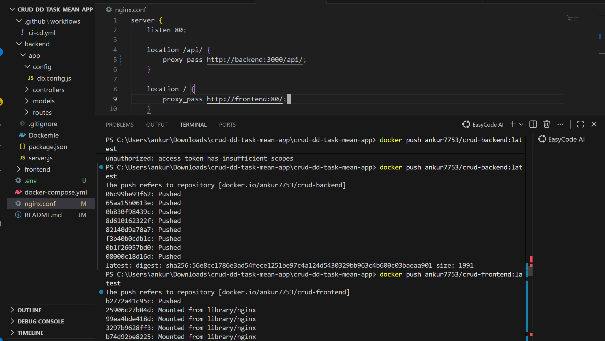
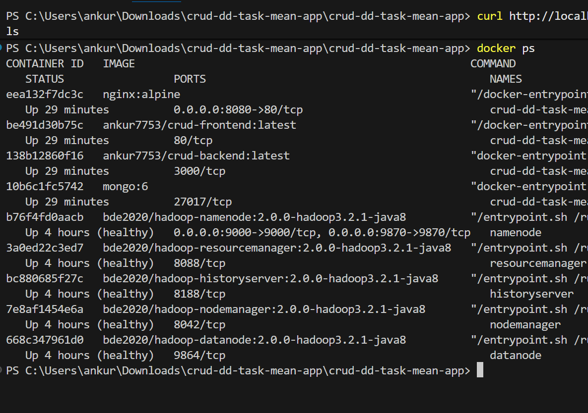
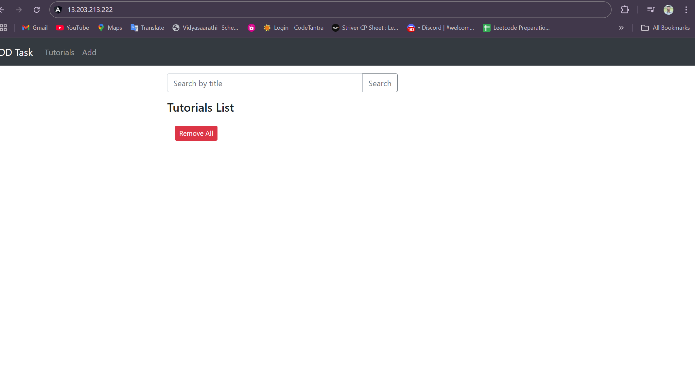
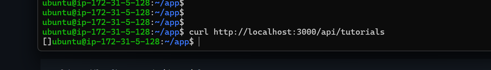
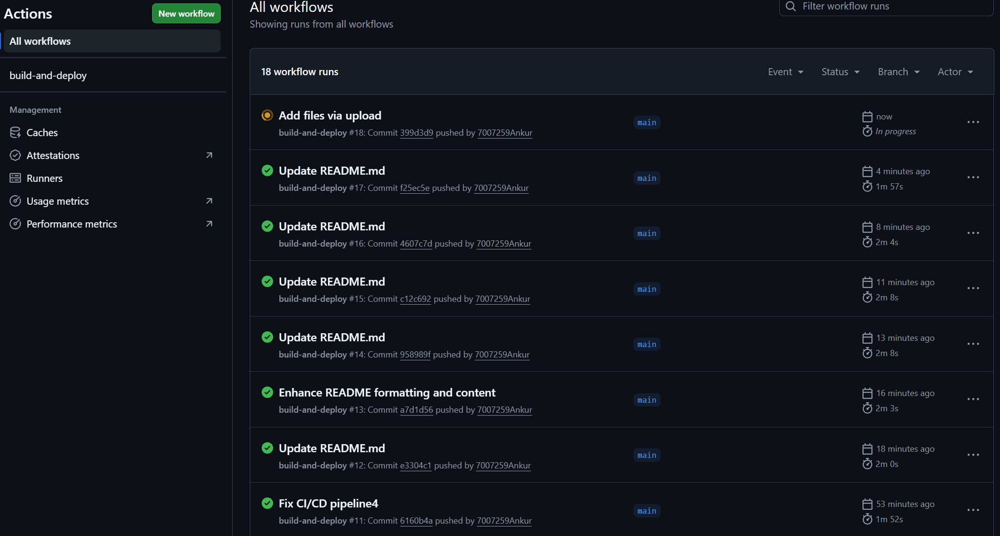

# 🚀 MEAN Stack DevOps Assignment – Discover Dollar

## 📌 Project Overview

This project demonstrates the complete DevOps workflow for containerizing, deploying, and automating a **MEAN Stack CRUD Application** using:

* **Docker** (frontend + backend + MongoDB + Nginx)
* **Docker Hub** (image registry)
* **AWS EC2 (Ubuntu)** (production server)
* **Docker Compose** (multi-service deployment)
* **GitHub Actions** (CI/CD pipeline)
* **Nginx Reverse Proxy** (serves frontend + proxies backend API)

The application is fully deployed and accessible at:
👉 **[http://YOUR-EC2-PUBLIC-IP/](http://YOUR-EC2-PUBLIC-IP/)**

---

# 📁 Folder Structure

```
crud-dd-task-mean-app/
├── backend/
├── frontend/
├── nginx.conf
├── docker-compose.yml
└── .github/workflows/build-and-deploy.yml
```

---

# 🐳 Docker Setup

### ✔ Frontend

* Angular app
* Built and served via Nginx
* Exposed on port **80** inside container

### ✔ Backend

* Node.js + Express API
* MongoDB connection via: `mongodb://mongo:27017/mydb`
* Runs on port **8080** inside container → exposed as **3000**

### ✔ MongoDB

* Official `mongo:6` Docker image
* Persistent volume enabled

### ✔ Nginx Reverse Proxy

```nginx
server {
    listen 80;

    location /api/ {
        proxy_pass http://backend:8080/;
    }

    location / {
        proxy_pass http://frontend:80/;
    }
}
```

### ✔ Docker Compose

Runs all services together:

```bash
docker-compose up -d
docker-compose down
```

---

# ☁️ AWS EC2 Deployment

### Steps performed:

1. Created **Ubuntu EC2 instance** (t2.micro, free-tier)
2. Installed:

   ```bash
   sudo apt update -y
   sudo apt install docker.io -y
   sudo apt install docker-compose -y
   ```
3. Uploaded `docker-compose.yml` & `nginx.conf` using GitHub Actions
4. Launched containers on EC2:

   ```bash
   cd ~/app
   docker-compose up -d
   ```

### Access Application

Frontend: `http://EC2_PUBLIC_IP/`
API: `http://EC2_PUBLIC_IP/api/tutorials`

---

# 🤖 CI/CD Pipeline (GitHub Actions)

Automation includes:

### ✔ On every push to `main`:

* Build Docker images (frontend & backend)
* Push to Docker Hub
* SCP updated config files to EC2
* SSH into EC2 & deploy application

### Workflow used:

```
.github/workflows/build-and-deploy.yml
```

Secrets used:

| Secret Name          | Purpose                     |
| -------------------- | --------------------------- |
| `DOCKERHUB_USERNAME` | Docker Hub username         |
| `DOCKERHUB_PASSWORD` | Docker Hub token/password   |
| `EC2_HOST`           | Public IP of EC2            |
| `EC2_SSH_KEY`        | Private key of EC2 instance |

---

# 📸 Required Screenshots for Submission

You MUST include these in your repository README or submission form:

### 🖼 1. Docker Images on Docker Hub



* Backend image
* Frontend image

### 🖼 2. Docker Compose Running on EC2

`docker ps` output showing 4 containers running:


* mongo
* backend
* frontend
* nginx

### 🖼 3. Working Application UI

* Screenshot of Angular CRUD dashboard

* 

### 🖼 4. API Response Test



Run:


```bash
curl http://localhost:3000/api/tutorials
```

### 🖼 5. GitHub Actions Pipeline

* Successful workflow run
* Green check ✔



### 🖼 6. Nginx reverse proxy file

`nginx.conf`

---

# 🧪 Testing

### Backend test:

```bash
curl http://EC2_PUBLIC_IP/api/tutorials
```

### Frontend test:

Open browser →

```
http://EC2_PUBLIC_IP/
```

---

# 🏁 Final Deliverables

Submit GitHub Repo URL with:

* Complete project folder
* Dockerfiles
* docker-compose.yml
* nginx.conf
* CI/CD workflow file
* README with screenshots

---

# 🎯 Conclusion

This assignment demonstrates:

* Containerization
* Cloud deployment
* Reverse proxying
* Automation using CI/CD
* GitOps-style delivery

Your setup is now **production-ready** and fully automated 🚀

If you want, I can also create **badges**, ** diagrams**, or a more stylish README.
